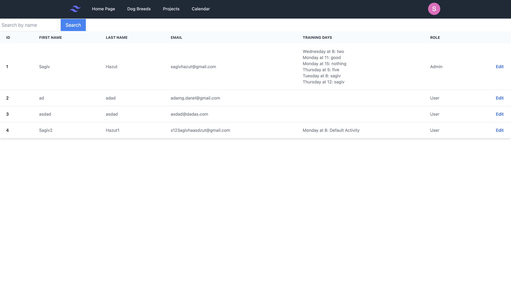
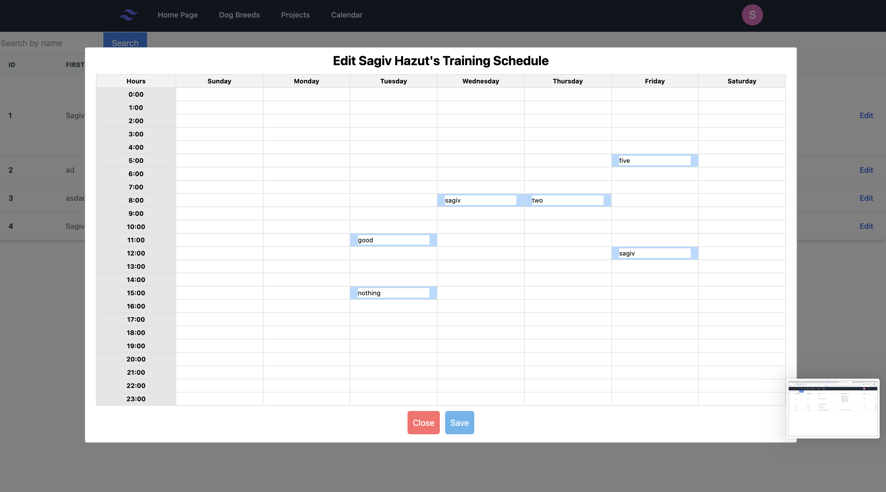
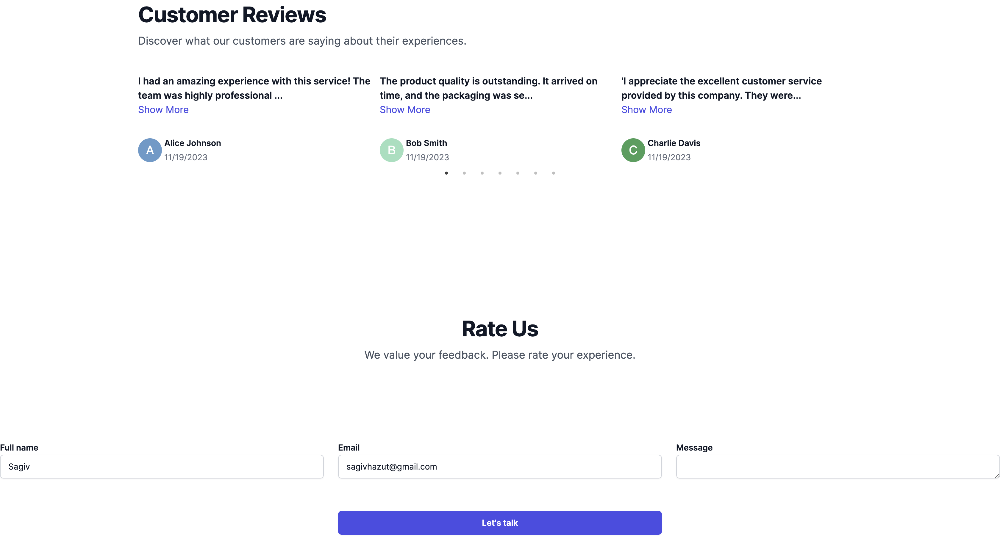
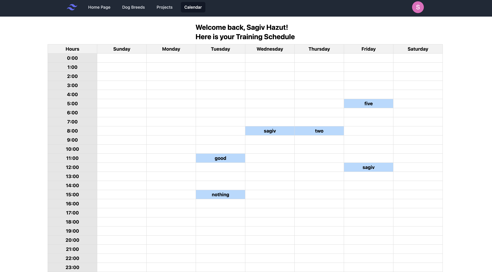

# Dog Whisperer Website

## Table of Contents

- [Description](#description)
- [Project Structure](#project-structure)
- [Features](#features)
- [Getting Started](#getting-started)
- [Usage](#usage)
- [Contributing](#contributing)
- [License](#license)
- [Screenshots](#Screenshots)

## Description

The Dog Whisperer Website is a Next.js-based platform designed for a dog trainer and his team. It features a user system for login and registration, an admin panel for user management, and personalized calendars for each user. The backend is built with Node.js, Express, MongoDB, and Mongoose.

## Project Structure

```plaintext
.next/
node_modules/
public/
  - next.svg
  - vercel.svg
src/
  app/
    - favicon.ico
    - globals.css
    - layout.js
    - page.js
  images/
    - adminEditPage.png
    - adminPanel.png
    - CustomerReviews.png
    - dogBreedsPage.png
    - userCalendar.png
  components/
    - AboutUs.jsx
    - BreedsImages.jsx
    - ContactSections.jsx
    - ImageCarousel.jsx
    - Login.jsx
    - Register.jsx
    - Reviews.jsx
    - SearchInput.jsx
    - Team.jsx
  libs/
    - ContactApis.js
    - DogsApis.js
    - UsersApi.js
  pages/
    - AdminPanel.jsx
    - BreedsDetails.jsx
    - Homepage.jsx
    - Layout.jsx
    - Navigation.jsx
    - ReviewsForm.jsx
    - SignIn.jsx
    - SignUp.jsx
    - UserCalendar.jsx
  styles/
    - Homepage.module.css
.eslintrc.json
.gitignore
jsconfig.json
next.config.js
package-lock.json
package.json
postcss.config.js
README.md
tailwind.config.js
```

## Features

User System: Register and log in to access personalized features.

Admin Panel: Manage users and their training schedules.

User Calendars: View and edit training schedules for the week.

Homepage Reviews: Post reviews on the homepage.

Dog Breeds Information: Explore detailed information about various dog breeds.

## Getting Started

To run the Dog Whisperer Website locally, follow these steps:

Clone the repository:

`git clone https://github.com/your-username/my-project.git`

Install dependencies:

`npm install`

Start the development server:

`npm start `

## Usage

Navigate to different pages to explore dog breeds, images, and use the website's features. Interact with the contact section for inquiries or feedback.

## Screenshots

Here are some screenshots of the Dog Whisperer Website:

### Admin Panel



### Admin Edit Page



### Customer Reviews



### Dog Breeds Page


### User Calendar



```

```
